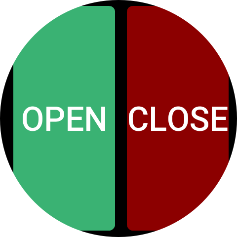
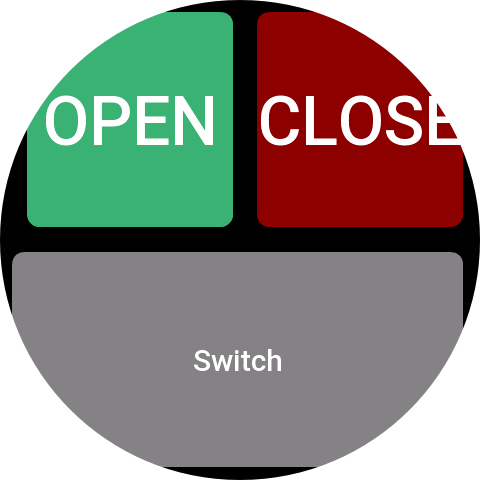
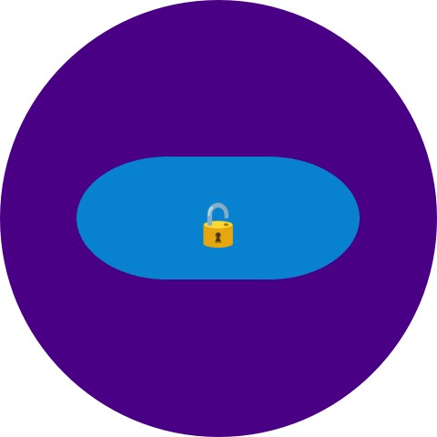
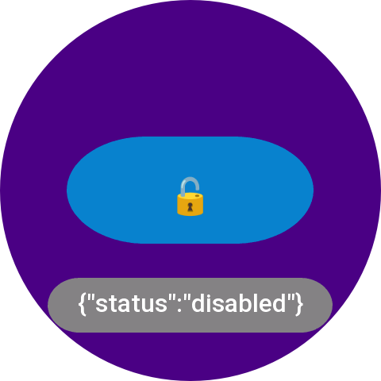

# HTTP-Buttons







## Description
HTTP-Buttons is a highly customizable ZEPPOS application where you can define an endless array of buttons, each capable of triggering an HTTP request. Ideal for home automation projects.

## Configuration Example
```
[
    {
        "variables": {
            "pihole_auth": ".......",
            "TV": "192.168.1.20",
            "AMP": "192.168.1.10"
        },
        "pages": [
            {
                "rows": [
                    {
                        "h": 10,
                        "buttons": []
                    },
                    {
                        "h": 40,
                        "buttons": [
                            {
                                "text": "Click me!",
                                "spacer": true,
                                "w": 10,
                                "request": {}
                            },
                            {
                                "text": "HT",
                                "spacer": false,
                                "w": 40,
                                "request": {},
                                "back_color": 3978097,
                                "radius": 100,
                                "text_color": 16777215,
                                "text_size": 70
                            },
                            {
                                "text": "TP",
                                "spacer": false,
                                "w": 40,
                                "request": {},
                                "radius": 100,
                                "back_color": 9109504,
                                "text_color": 16777215,
                                "text_size": 70
                            }
                        ]
                    },
                    {
                        "h": 30,
                        "buttons": [
                            {
                                "text": "SPACER",
                                "spacer": true,
                                "w": 10,
                                "request": {}
                            },
                            {
                                "text": "Buttons",
                                "spacer": false,
                                "w": 80,
                                "request": {},
                                "radius": 30,
                                "back_color": 16753920,
                                "text_color": 16777215,
                                "text_size": 80
                            }
                        ]
                    }
                ],
                "title": "",
                "back_color": 3355443,
                "text_color": 16777215
            },
            {
                "title": "",
                "rows": [
                    {
                        "h": 10,
                        "buttons": []
                    },
                    {
                        "buttons": [
                            {
                                "text": "SPACER",
                                "spacer": true,
                                "w": 5,
                                "request": {},
                                "back_color": 16753920
                            },
                            {
                                "text": "ON",
                                "spacer": false,
                                "w": 45,
                                "request": {
                                    "url": "http://{AMP}/on",
                                    "method": "GET",
                                    "responsestyle": 1
                                },
                                "radius": 100,
                                "back_color": 3978097,
                                "text_color": 16777215,
                                "text_size": 54
                            },
                            {
                                "text": "OFF",
                                "spacer": false,
                                "w": 45,
                                "request": {
                                    "url": "http://{AMP}/off",
                                    "method": "GET",
                                    "responsestyle": 0
                                },
                                "radius": 100,
                                "back_color": 9109504,
                                "text_color": 16777215,
                                "text_size": 56
                            }
                        ],
                        "h": 40
                    },
                    {
                        "buttons": [
                            {
                                "text": "SPACER",
                                "spacer": true,
                                "w": 10,
                                "request": {}
                            },
                            {
                                "text": "🔊➕",
                                "spacer": false,
                                "w": 30,
                                "request": {
                                    "url": "http://{AMP}/volup",
                                    "method": "GET",
                                    "responsestyle": 1
                                },
                                "radius": 10,
                                "back_color": 16753920,
                                "text_color": 16777215,
                                "text_size": 56
                            },
                            {
                                "text": "🔇",
                                "spacer": false,
                                "w": 20,
                                "request": {
                                    "url": "http://{AMP}/mute",
                                    "method": "GET",
                                    "responsestyle": 1
                                },
                                "radius": 10,
                                "back_color": 16753920,
                                "text_color": 16777215,
                                "text_size": 56
                            },
                            {
                                "text": "🔉➖",
                                "spacer": false,
                                "w": 30,
                                "request": {
                                    "url": "http://{AMP}/voldown",
                                    "method": "GET",
                                    "responsestyle": 1
                                },
                                "radius": 10,
                                "back_color": 16753920,
                                "text_size": 56
                            }
                        ],
                        "h": 25
                    },
                    {
                        "h": 25,
                        "buttons": [
                            {
                                "text": "SPACER",
                                "spacer": true,
                                "w": 22,
                                "request": {}
                            },
                            {
                                "text": "Plex",
                                "spacer": false,
                                "w": 28,
                                "request": {
                                    "responsestyle": 1
                                },
                                "back_color": 8421504,
                                "text_color": 16753920,
                                "radius": 40
                            },
                            {
                                "text": "TV",
                                "spacer": false,
                                "w": 28,
                                "request": {
                                    "responsestyle": 1
                                },
                                "radius": 40,
                                "back_color": 8421504,
                                "text_color": 16753920
                            }
                        ]
                    }
                ],
                "back_color": 0,
                "text_color": 16753920
            },
            {
                "rows": [
                    {
                        "h": 30,
                        "buttons": []
                    },
                    {
                        "buttons": [
                            {
                                "text": " ",
                                "spacer": true,
                                "w": 15,
                                "request": {
                                    "url": " ",
                                    "method": " "
                                },
                                "radius": 100,
                                "back_color": 4915330,
                                "text_color": 16753920
                            },
                            {
                                "text": "🔓",
                                "spacer": false,
                                "w": 35,
                                "request": {
                                    "method": "GET",
                                    "url": "http://pi.hole/admin/api.php?disable=600&auth={pihole_auth}",
                                    "params": "",
                                    "responsestyle": 0,
                                    "parse_result": "status"
                                },
                                "radius": 100,
                                "back_color": 558288,
                                "text_size": 70,
                                "text_color": 16777215
                            },
                            {
                                "text": "🔒",
                                "spacer": false,
                                "w": 35,
                                "request": {
                                    "url": "http://pi.hole/admin/api.php?enable&auth={pihole_auth}",
                                    "method": "GET",
                                    "responsestyle": 0,
                                    "parse_result": "status"
                                },
                                "radius": 100,
                                "back_color": 15631086,
                                "text_color": 16777215,
                                "text_size": 70
                            }
                        ],
                        "h": 40
                    }
                ],
                "title": "",
                "back_color": 4915330,
                "text_color": 16777215
            },
            {
                "rows": [
                    {
                        "h": 100,
                        "buttons": [
                            {
                                "text": "1",
                                "spacer": false,
                                "w": 33,
                                "request": {
                                    "body": "{\"key\":\"Digit1\"}",
                                    "method": "POST",
                                    "url": "http://{TV}:1925/input/6/key"
                                },
                                "back_color": 16753920,
                                "text_color": 16777215,
                                "radius": 100
                            },
                            {
                                "text": "2",
                                "spacer": false,
                                "w": 33,
                                "request": {
                                    "body": "{\"key\":\"Digit2\"}",
                                    "method": "POST",
                                    "url": "http://{TV}:1925/input/1/key"
                                },
                                "radius": 100,
                                "text_color": 16777215,
                                "back_color": 16753920
                            },
                            {
                                "text": "3",
                                "spacer": false,
                                "w": 33,
                                "request": {
                                    "url": "http://{TV}:1925/input/1/key",
                                    "method": "POST",
                                    "body": "{\"key\":\"Digit3\"}"
                                },
                                "radius": 100,
                                "back_color": 16753920,
                                "text_color": 16777215
                            }
                        ]
                    },
                    {
                        "h": 100,
                        "buttons": [
                            {
                                "text": "4",
                                "spacer": false,
                                "w": 33,
                                "request": {
                                    "body": "{\"key\":\"Digit4\"}",
                                    "url": "http://{TV}:1925/input/1/key",
                                    "method": "POST"
                                },
                                "back_color": 16753920,
                                "text_color": 16777215,
                                "radius": 100
                            },
                            {
                                "text": "5",
                                "spacer": false,
                                "w": 33,
                                "request": {
                                    "url": "http://{TV}:1925/input/1/key",
                                    "method": "POST",
                                    "body": "{\"key\":\"Digit5\"}"
                                },
                                "radius": 100,
                                "back_color": 16753920,
                                "text_color": 16777215
                            },
                            {
                                "text": "6",
                                "spacer": false,
                                "w": 33,
                                "request": {
                                    "url": "http://{TV}:1925/input/1/key",
                                    "method": "POST",
                                    "body": "{\"key\":\"Digit6\"}"
                                },
                                "radius": 100,
                                "back_color": 16753920,
                                "text_color": 16777215
                            }
                        ]
                    },
                    {
                        "h": 100,
                        "buttons": [
                            {
                                "text": "7",
                                "spacer": false,
                                "w": 33,
                                "request": {
                                    "url": "http://{TV}:1925/input/1/key",
                                    "method": "POST",
                                    "body": "{\"key\":\"Digit7\"}",
                                    "responsestyle": 1
                                },
                                "radius": 100,
                                "back_color": 16753920,
                                "text_color": 16777215
                            },
                            {
                                "text": "8",
                                "spacer": false,
                                "w": 60,
                                "request": {
                                    "url": "http://{TV}:1925/input/1/key",
                                    "method": "POST",
                                    "body": "{\"key\":\"Digit8\"}"
                                },
                                "radius": 100,
                                "back_color": 16753920,
                                "text_color": 16777215
                            },
                            {
                                "text": "9",
                                "spacer": false,
                                "w": 60,
                                "request": {
                                    "url": "http://{TV}:1925/input/1/key",
                                    "body": "{\"key\":\"Digit9\"}",
                                    "method": "POST"
                                },
                                "radius": 100,
                                "back_color": 16753920,
                                "text_color": 16777215
                            }
                        ]
                    },
                    {
                        "h": 100,
                        "buttons": [
                            {
                                "text": "➕",
                                "spacer": false,
                                "w": 33,
                                "request": {
                                    "url": "http://{TV}:1925/input/1/key",
                                    "method": "POST",
                                    "body": "{\"key\":\"ChannelStepUp\"}"
                                },
                                "radius": 100,
                                "back_color": 16753920
                            },
                            {
                                "text": "0",
                                "spacer": false,
                                "w": 33,
                                "request": {
                                    "url": "http://{TV}:1925/input/1/key",
                                    "body": "{\"key\":\"Digit0\"}",
                                    "method": "POST"
                                },
                                "radius": 100,
                                "back_color": 16753920,
                                "text_color": 16777215
                            },
                            {
                                "text": "➖",
                                "spacer": false,
                                "w": 33,
                                "request": {
                                    "url": "http://{TV}:1925/input/1/key",
                                    "method": "POST",
                                    "body": "{\"key\":\"ChannelStepDown\"}"
                                },
                                "radius": 100,
                                "back_color": 16753920
                            }
                        ]
                    }
                ],
                "title": "TV"
            },
            {
                "rows": [
                    {
                        "buttons": [
                            {
                                "text": "Useless fact",
                                "spacer": false,
                                "w": 50,
                                "request": {
                                    "url": "https://uselessfacts.jsph.pl/api/v2/facts/today",
                                    "method": "GET",
                                    "headers": "",
                                    "responsestyle": 0,
                                    "parse_result": "text",
                                    "response_style": 0
                                },
                                "back_color": 3978097,
                                "text_color": 16777215,
                                "text_size": 30
                            },
                            {
                                "text": "💶👉💵",
                                "spacer": false,
                                "w": 50,
                                "request": {
                                    "url": "https://latest.currency-api.pages.dev/v1/currencies/eur.json",
                                    "method": "GET",
                                    "responsestyle": 1,
                                    "response_style": 0,
                                    "parse_result": "usd"
                                },
                                "back_color": 16777215,
                                "text_color": 16777215,
                                "text_size": 60,
                                "radius": 30
                            }
                        ],
                        "h": 70
                    },
                    {
                        "buttons": [
                            {
                                "text": "Click me!",
                                "spacer": true,
                                "w": 30,
                                "request": {}
                            },
                            {
                                "text": "👍or👎",
                                "spacer": false,
                                "w": "40",
                                "request": {
                                    "url": "https://yesno.wtf/api",
                                    "method": "GET",
                                    "responsestyle": 0,
                                    "parse_result": "answer",
                                    "response_style": 1
                                },
                                "back_color": 558288,
                                "text_color": 16776960,
                                "text_size": 76,
                                "radius": 10
                            }
                        ],
                        "h": 30
                    }
                ],
                "title": "TEST PAGE",
                "back_color": 0,
                "text_color": 16776960
            }
        ]
    }
]
```