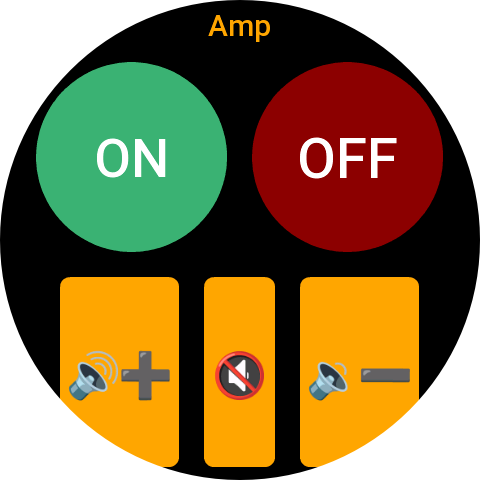
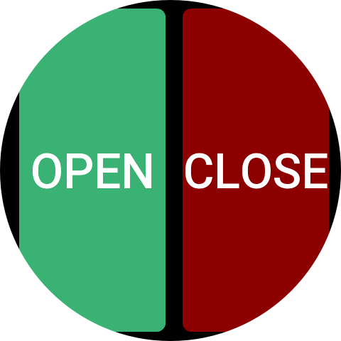
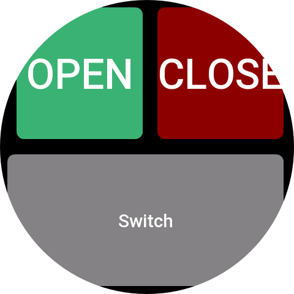
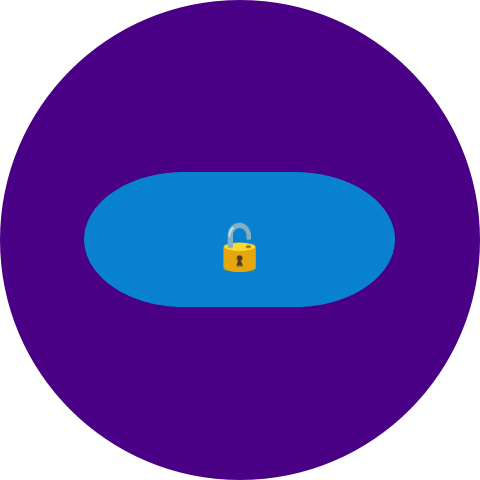
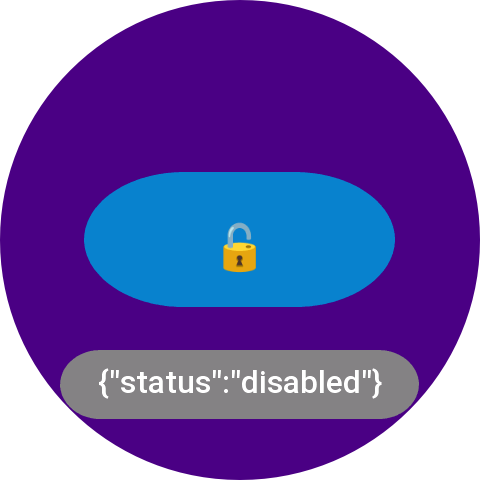

# HTTP-Buttons

A highly customizable ZeppOS application that lets you create buttons to trigger HTTP requests directly from your smartwatch. Perfect for home automation, IoT control, and quick API interactions.

## Screenshots

<p align="center">
  
  
  
</p>
<p align="center">
  
  
</p>

## Features

- **Multiple Pages** — Swipe between different button layouts
- **Customizable Buttons** — Set colors, sizes, radius, and text for each button
- **HTTP Methods** — Support for GET, POST, PUT, DELETE, PATCH, and more
- **Authentication** — Basic, Bearer, and Digest authentication support, plus an optional two-step (session) flow: login → token → reuse → logout
- **Global Variables** — Define reusable variables like IP addresses or tokens
- **Input Keyboard** — On-watch keyboard for dynamic request parameters
- **Response Handling** — Choose between toast, modal, or silent notifications
- **Image Display** — Fetch a remote image (PNG/JPEG) and show it fullscreen on the watch
- **JSON Parsing** — Extract specific fields from API responses, with path expressions like `choices[0].message.content`, `[*]` wildcards and `[?field==value]` filters
- **Timeouts** — Global and per-button request timeouts (5–60 s) for slow endpoints

## Installation

1. Install the app from the Zepp App Store
2. Open the Zepp app on your phone
3. Go to the app settings to configure your buttons

## Configuration

All configuration is done through the companion app on your phone. You can:

- Add/remove pages, rows, and buttons
- Set button properties (text, colors, size)
- Configure HTTP requests (URL, method, headers, body)
- Define global variables for reuse across buttons
- Choose response notification style

### Global Variables

Define variables once and use them in any button URL, header, or body with `{variable_name}` syntax:

```json
{
  "variables": {
    "server_ip": "192.168.1.100",
    "api_token": "your-token-here"
  }
}
```

Then use in URLs: `http://{server_ip}/api/action`

### Input Buttons

Enable the "Input" option on a button to show an on-watch keyboard. The typed text replaces `{input}` in your request URL or body.

### Response Parsing (`parse_result`)

The `parse_result` field of a request extracts a value from the JSON response body instead of showing the whole payload. Two modes, chosen automatically:

- **Bare key** (no dots or brackets), e.g. `"fact"` — searches the whole response tree for that key name, at any depth, and shows every match. Simple and forgiving; ideal when the interesting field has a unique name.
- **Path expression** (contains `.` or `[…]`) — walks the exact path from the root:

| Expression | Meaning |
|---|---|
| `data.user.name` | nested field |
| `choices[0].message.content` | array element by index (`choices.0.…` works too) |
| `items[-1].id` | negative index counts from the end |
| `choices[*].message.content` | all elements — results are joined with commas |
| `choices[?finish_reason==stop].message.content` | only elements whose field equals the value |

The filter also accepts the JSONPath spelling `[?(@.finish_reason=='stop')]`; quotes around the value are optional. If a path expression matches nothing, the app falls back to the loose key search, and finally to showing the full response — so a wrong expression never hides the data.

### Request Timeouts

By default each request may run for **10 seconds** before failing. Slow endpoints (e.g. AI services that generate a response) may need more: raise the global **Request timeout** in the settings, or override it per button with the **Timeout** select (5–60 s). The same timeout also bounds the image download of Image-style buttons.

> **Platform limit:** the phone's native HTTP client aborts a request after ~10 s of *silence* from the server (generic `network error`), regardless of the timeout configured here. The total duration may exceed 10 s as long as the server keeps sending bytes — timeouts above 10 s therefore only help with endpoints that stream or send keep-alive bytes while working. For servers that stay silent until the full response is ready, use an async pattern instead — see *Async jobs (polling)* below.

In the JSON config the value is in milliseconds: `"timeout"` at the top level sets the global default, `"timeout"` inside a button's `request` overrides it (a `session` block's `login`/`logout` sub-requests accept their own too):

```json
{
  "timeout": 20000,
  "pages": [ ... ]
}
```

```json
{
  "text": "🤖 Ask AI",
  "request": {
    "url": "https://host/webhook/ask",
    "method": "POST",
    "timeout": 45000,
    "response_style": 2
  }
}
```

### Image Display

Set a button's **response style** to **Image** to fetch a remote image (PNG or JPEG — e.g. an IP-camera snapshot) and show it fullscreen on the watch (tap to dismiss). The image is downloaded and converted on the phone, then pushed to the watch and scaled to fit the screen. Basic, Bearer, and Digest auth are supported.

```json
{
  "text": "📷 Camera",
  "request": {
    "url": "http://{cam}/snapshot?channel=0",
    "method": "GET",
    "auth": "Digest",
    "user": "admin",
    "pass": "password",
    "response_style": 4
  }
}
```

### Two-step (session) authentication

Some services don't accept static credentials on the action request: they require a **separate login** that returns a temporary token/session id, which you then reuse on the real request (e.g. session-based dashboards and hypervisor/NAS admin APIs). Add an optional `session` block to a button's `request` to support this. Buttons **without** a `session` block behave exactly as before.

The flow is: **login → extract token → inject into the main request → (optional) logout.** The login and logout are ordinary requests (they accept the same `url`, `method`, `headers`, `body`, and even their own `auth`). The extracted value is substituted wherever you write the `{{token}}` placeholder (URL, headers, body, …).

```json
{
  "text": "Reload",
  "request": {
    "method": "POST",
    "url": "https://host/api/reload",
    "headers": "{\"X-Session\": \"{{token}}\"}",
    "response_style": 1,
    "session": {
      "login":   { "method": "POST", "url": "https://host/api/login", "body": "{\"pass\":\"secret\"}" },
      "extract": { "path": "session.sid", "as": "token", "ttl": 1800, "ttl_path": "session.validity" },
      "logout":  { "method": "POST", "url": "https://host/api/logout", "headers": "{\"X-Session\": \"{{token}}\"}", "mode": "expiry" }
    }
  }
}
```

- **`login`** — the preliminary request that returns the token.
- **`extract.path`** — exact path to the value in the login response body (`session.sid`, `data.token`, `items[0].id` — dot and bracket indices supported). **`as`** names the placeholder (`{{token}}` here).
- **`extract.ttl`** — seconds to keep the token cached, so rapid presses reuse the same session instead of logging in every time. **`ttl_path`** (optional) reads the lifetime from the login response instead. With no ttl the token is not reused.
- **`logout`** (optional) — `mode: "each"` runs login → main → logout on every press; `mode: "expiry"` (default) keeps the cached session and logs out only when it expires or when the app closes.
- **Errors are labelled by phase** on the watch: `Auth: …` (login failed, main not run) vs `Req: …` (main failed); logout failures are silent.

The token cache is in-memory only. This flow applies to normal requests; image buttons ignore a `session` block.

### Async jobs (polling)

Some endpoints take longer than the platform allows (see the ~10 s silence limit under *Request Timeouts*) — typically AI workflows: the full answer isn't ready within the window the phone gives a single request. The fix is to split the work in two: the button's request only **starts** the job and returns immediately (e.g. with a job id), then the watch **polls** a second URL until the result is ready. Add an optional `poll` block to the button's `request`:

```json
{
  "text": "🤖 Ask AI",
  "request": {
    "method": "POST",
    "url": "https://host/webhook/ask",
    "body": "{\"q\": \"{input}\"}",
    "parse_result": "answer",
    "response_style": 2,
    "poll": {
      "extract": { "path": "id", "as": "job" },
      "url": "https://host/webhook/result?id={{job}}",
      "every": 2000,
      "max": 30,
      "until": "answer"
    }
  }
}
```

- **`url`** (required) — the poll request. Placeholders work as everywhere else: `{variables}`, `{input}`, the extracted `{{job}}`, and `{{token}}` when a `session` block is present. `method` defaults to GET; `headers`, `body`, `auth`/`user`/`pass`/`token` and `timeout` are accepted like on any request.
- **`extract`** — where in the *first* response the job id lives (`path`, dotted/bracket syntax; `as` names the placeholder, default `job`). Omit it if the poll URL needs no id.
- **`every`** — milliseconds between attempts (default 2000, clamped to 1–60 s). Attempts never overlap: the next wait starts when the previous attempt settles.
- **`max`** — attempts before giving up with `Poll: not ready…` (default 30, up to 120).
- **`until`** — path that must yield a non-empty value in a poll response for it to count as the result. Without it, the first 2xx response wins. Not-ready responses (404, errors) just schedule the next attempt.

The button's `parse_result` and `response_style` apply to the **final** poll response, and the button spinner runs until the poll settles. Polling only runs while the app is open on the watch; leaving the page cancels pending attempts. Image buttons ignore a `poll` block.

Server-side, any backend or automation platform can implement the matching pair: the start endpoint replies immediately (`{"id": "..."}`) and kicks off the work; the result endpoint returns `{}` while the job is running and `{"answer": "..."}` when done.

## Configuration Example

```json
{
  "variables": {
    "TV": "192.168.1.20",
    "AMP": "192.168.1.10"
  },
  "pages": [
    {
      "title": "Home",
      "back_color": 0,
      "rows": [
        {
          "h": 50,
          "buttons": [
            {
              "text": "ON",
              "w": 50,
              "back_color": 3978097,
              "radius": 100,
              "request": {
                "url": "http://{AMP}/on",
                "method": "GET",
                "response_style": 1
              }
            },
            {
              "text": "OFF",
              "w": 50,
              "back_color": 9109504,
              "radius": 100,
              "request": {
                "url": "http://{AMP}/off",
                "method": "GET",
                "response_style": 1
              }
            }
          ]
        }
      ]
    }
  ]
}
```

## Use Cases

- **Home Automation** — Control lights, thermostats, and smart devices
- **Camera Snapshots** — View an IP-camera still on your wrist
- **Media Control** — Play/pause, volume, channel switching
- **IoT Devices** — Trigger actions on Raspberry Pi, ESP32, etc.
- **API Testing** — Quick endpoint testing from your wrist
- **Shortcuts** — Execute webhooks and automations (IFTTT, Home Assistant, etc.)

## Compatibility

Works with ZeppOS 3.0+ devices including:
- Amazfit GTR/GTS series
- Amazfit Balance, Cheetah, T-Rex Ultra
- And other ZeppOS compatible watches

## License

MIT License — see [LICENSE](LICENSE) for details.

---

Made with ❤️ for the ZeppOS community